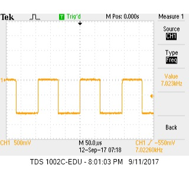
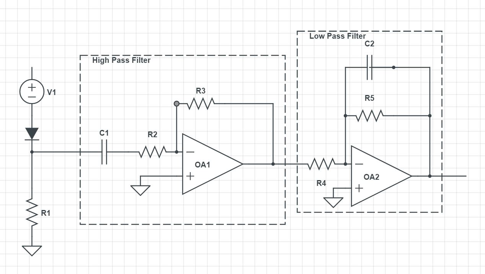
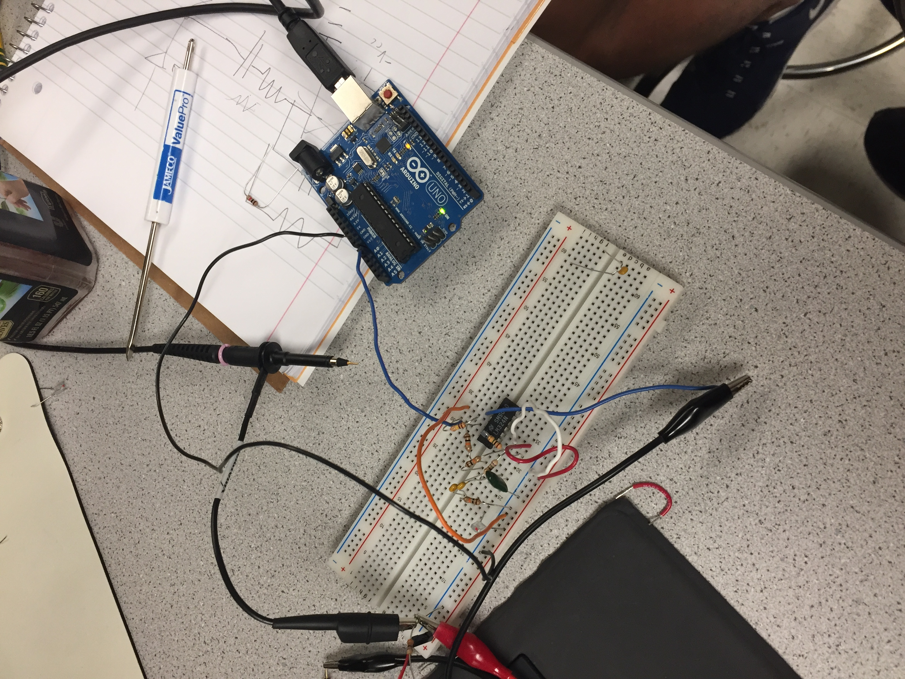
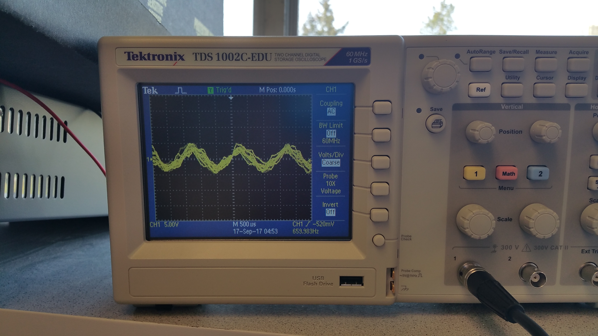
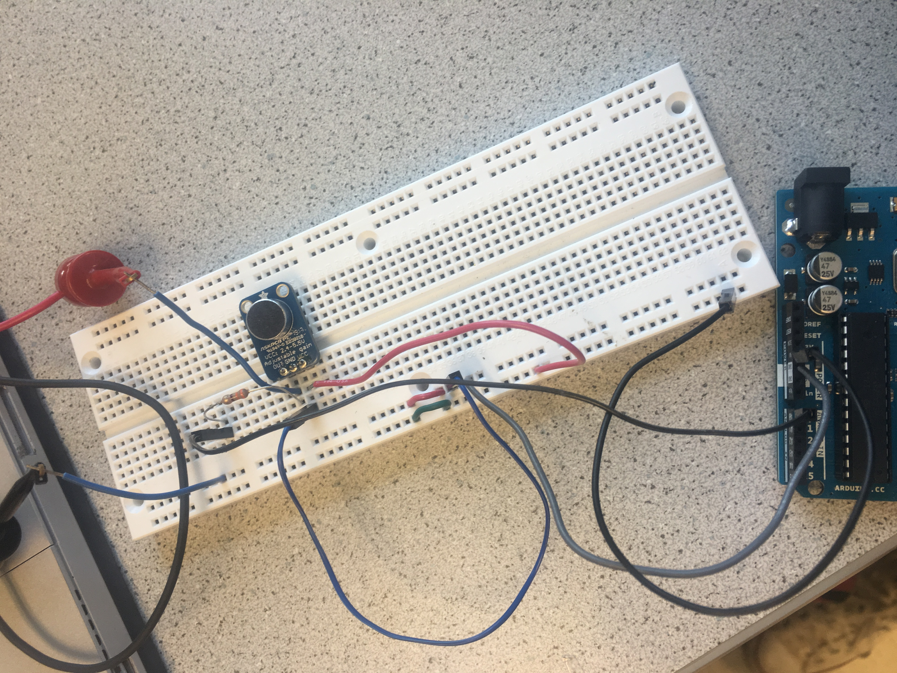
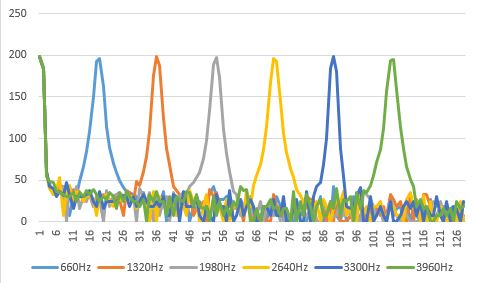
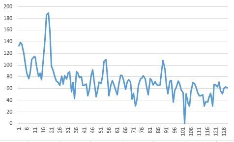

# __*Lab 2*__

### Objective
Our objective for this lab was to create two of the major sensors for our robots. The first sensor was a microphone circuit, which should be able to detect a 660Hz sound, which will eventually trigger the robot to begin its task. The other sensor is an optical circuit using a phototransistor, which should be able to detect a 7 kHz IR signal. The major key in this experiment was to be able to amplify and filter the circuits in such a way that the signals would be strong enough to be detected, and only the desired frequencies would be detected.

### Work Distribution
Since this lab was split into two major parts, we split into two teams. The acoustic team consisted of Adam, Kelsey, and David, while the optical team consisted of Rajiv, Aaron, and Christina.

### Lab Documentation

#### Materials
We found the materials needed for this lab
* Breadboard
* Resistors
* Wires
* Capacitors
* LM324N OpAmp
* Multimeter
* Oscilloscope
* Power Supply
* Arduino Uno
* Phototransistor
* Treasure Board

### Optical Team

#### Designing the filters
We began by reading the the signal from the treasure board onto the oscilloscope, to get a sense of what the signal be need to be detecting is. We adjusted the treasure's frequency oscilloscope's sensitivity and range until we got the reading shown below:



We noticed that the treasure had to be held very close to the phototransistor to get even a weak signal, so we decided that we would need to amplify the signal by using an OpAmp. In order to cut out all of the noise from the lights in the room, we needed to design a filter which would only be able to detect the signal from the treasure. After messing around with different ideas for bandpass filters, we decided that the best plan of action would be to create two filters, a high pass filter and a low pass filter. Using a computer aid and schematic (pictured below), we connected a high pass filter to our input signal and a low pass filter to our output signal (after the amplification).



We calculated the values to meet the following criteria:

* The input impedance was much larger than the IR sensors output impedance
* Passband of filter must be over the frequencies of interest, 5KHz - 15KHz
* Gain of close to 1000

Here are the final values:

| Component | Value |
| ------------- |:-------------:|
| OA1 | LM324N |
| OA1 | LM324N  |
| R1 | 10K Ohms |
| R2 | 10K Ohms |
| R3 | 1M Ohms |
| R4 | 10K Ohms |
| R5 | 100K Ohms |
| R6 | 1K Ohms |
| C1 | 4.7 nF |
| C2 | 110 pF |

The transfer function of the amplifier looks as follows. The passband is roughly 2KHz - 20KHz.


We were left with a circuit that looked like this:


After seeing that we could get a decent-looking reading out from the oscilloscope with this circuit when the IR treasure was shined on it, we hooked it up to the Arduino.



After writing some code, shown below, we were able to read out the intensity of our signal to the computer:

```c++
#define IR_PIN A0

void setup() {
  pinMode(IR_PIN, INPUT);
  Serial.begin(115200);
}

void loop() {
  unsigned long res = getAvg();
  Serial.println(res);
}

unsigned long getAvg()
{
  unsigned long ret = 0;
  for (int i = 0; i < 1000; i++)
  {
    ret += analogRead(IR_PIN);
    delayMicroseconds(100);
  }

  return ret / 1000;
}

```

[Here's a video of the light intensity values read out by the Arduino as the distance is varied](https://www.youtube.com/watch?v=5Cgi-F-WJ3k)

By using this information, we found that the threshold we would need to impose on the readings should be 20, because there is some IR light in the room not from the treasure. Once this was done, we could confidently say that once the reading surpassed 20, then the IR light being detected must be coming from the treasure. To demonstrate this, we modified the previous code and hooked up an LED such that when the IR treasure has been detected, the LED would light up.

```c++
#define IR_PIN A0
#define DETECT_THRESH 20
#define LED_PIN 2

void setup() {
  pinMode(IR_PIN, INPUT);
  pinMode(LED_PIN, OUTPUT);
  Serial.begin(115200);
}

void loop() {
  unsigned long res = getAvg();
  if (res >= DETECT_THRESH) {
    Serial.print("Detection! Value: ");
    digitalWrite(LED_PIN, HIGH);
  } else {
    Serial.print("No detection! Value: ");
    digitalWrite(LED_PIN, LOW);
  }
  Serial.println(res);

  //delay(500);
}


unsigned long getAvg()
{
  unsigned long ret = 0;
  for (int i = 0; i < 1000; i++)
  {
    ret += analogRead(IR_PIN);
    delayMicroseconds(100);
  }

  return ret / 1000;
}
```

[See it in action here!](https://www.youtube.com/watch?v=T8tgYlkvlMY)


#### Results and Conclusion

Upon completion of the lab, the optical team was able to successfully create a circuit which can detect an IR signal of 7 kHz, and distinguish it from light in the room.

### Acoustic Team

#### Testing the Microphone and FFT_ADC_Serial sketch

We started off by seeing the kind of output the microphone had by hooking it up to the oscilloscope. Initially, it had a relatively small output. To address this problem we approached it two different ways. We created an non-inverting amplifier and  we also tried using the small circuitry attached to the microphone itself.

The microphone's own adujustable gain proved to be enough to get a large output for reading the frequency. We were able to adjust that gain by raising the pot on the back of the microphone to max.
[Microphone descrpition and datasheet on Adafruit](https://www.adafruit.com/product/1063)
Here is an example of the output we got from playing the 660Hz tone into the adjusted mircrophone:


Additionally, here is a picture of our microphone circuit:


Next, we studied the ADC of the arduino, the FFT library and the fft_adc_serial sketch. With a bit of research on the [Atmega328 Data sheet](http://www.atmel.com/Images/Atmel-42735-8-bit-AVR-Microcontroller-ATmega328-328P_Datasheet.pdf), we were able to gather some useful info on the ADC starting on page 305. Some of the most important specs are
* It has 10-bit Resolution
* The ADC clock is dependent on the chosen prescaler which is set based on the last 3 bits of the ADCSRA register
* The default prescaler is 128 which maps to a clock of 125 kHz. A prescaler of 64 maps to 250 kHz and then so on and so forth accordingly
* The arduino requires an input clock frequency between 50kHz and 200kHz to get maximum resolution
* A normal conversion takes 13 ADC clock cycles
* The sampling frequency is the clock rate divided by the amount of cycles, Fs=Clock rate/cycles.(Fs=125000/13=9615Hz)
* The output is stored in ADCL and ADCH registers
* The ADC can be run in a variety of ways, we chose to use the ADC's free running mode

First, we had to alter our code a bit, in order to correct the prescaler. The original fft_adc_serial sketch placed the prescaler value at 32, which results in a clock of 500kHz. That would then decrease the accuracy of our readings. The register that set up the prescaler was the ADCSRA. The last 3 bits of the register are what determine the prescaler based on pages 319 and 320 in the ATmega328 datasheet.  The code originally read at
``` C
void setup() {
  Serial.begin(9600); 
  TIMSK0 = 0;
  ADCSRA = 0xe5; // <---THIS LINE set the adc to free running mode and set the prescaler originally to 32
  ADMUX = 0x40;
  DIDR0 = 0x01; 
}
void loop() {
  while(1) {
    cli();  
    byte freq = 0;
    byte test = 0;
    for (int i = 0 ; i < 512 ; i += 2) { 
      while(!(ADCSRA & 0x10)); 
      ADCSRA = 0xf5; // <------THIS LINE resets the ADC and also the precaler as well.
```
We ended up changing the first line to ADCSRA = 0xe7 and the second reset line to ADCSRA = 0xf7. This way the prescaler is 128 and the clock is at 125kHz.  
Using this information, we were able to build off of code previously provided in the API, and plot the fourier transforms of the signals we picked up with the microphone. We began by running the sample script, fft_adc_serial, with an output from the function generator. We captured the transform data of many waveforms at various frequencies, and compared the outputs on a single excel graph.



This graph shows evenly spaced bins for multiples of a 660 Hz signal. We also know that our 660 Hz signal is in the correct bin based on our calculations. We, first, divided the sampling frequency of 9615Hz by the amount of samples, 256, to get the FFT bin width.(9615/256=37.6Hz) Next, we take the signal we want, 660Hz, and divide it by the bin width to get the bin number that our signal will fall into. (660/37.6=17.6) This predicts our signal will fall into the 18th bin, if rounded up, and that is what we see visually through our data.  

#### Running Microphone and 660 Hz tone through the ADC

After learning the to use the fft sketch, we next hooked up the microphones output to the A0 pin and did an FFT of the 660 Hz output through the microphone. After graphin the data, we found that we were able to get a similar graph to that of the generated signal using the function generator. We got a signal at the 18th bin, which was the same bin number as our function generator proving that our sound detection is correct. We were able to get this data by physically printing the different magnitudes in each bin of the fft output and then plotting them in excel.   



We also added a small code snippet that prints different statements when a 660Hz is detected.

```
byte freq=0;
byte test = 0;
...
for (byte i = 0 ; i < FFT_N/2 ; i++) { 
      Serial.println(fft_log_out[i]); // send out the data
      if (fft_log_out[i] > test){
        test = fft_log_out[i];
        freq = i;  
      }
    }
    if (freq == 18)
      Serial.println("This is a 660 Hz tone");
    else  Serial.println("This is NOT a 660 Hz tone"); 
```
It simply decides whether the signal is 660Hz or not by making sure the highest value is at the correct bin number. 
