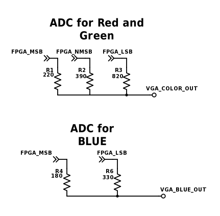
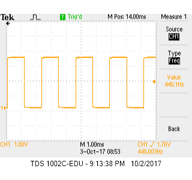
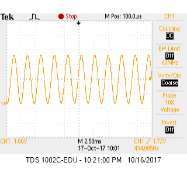

# __*Lab 3*__

### Objective
The objective of this lab was to configure an FPGA to (1) display graphics on a VGA monitor and (2) generate a tune consisting of at least three distinct tones to be played through speakers.

### Work Distribution
We split our lab group into two, with Adam, David and Aaron working on the VGA display portion and Kelsey, Rajiv and Christina working on the acoustic portion.

### Helpful Links
* [8-bit R2R DAC datasheet](http://www.bourns.com/docs/Product-Datasheets/R2R.pdf)
* [DE0-Nano user manual](https://www.altera.com/en_US/pdfs/literature/ug/DE0_Nano_User_Manual_v1.9.pdf)

### Lab Documentation

#### Materials
* Arduino Uno
* FPGA DEO_nano
* Breadboard
* Resistors
* 4 Push Buttons
* VGA Screen
* VGA Connector
* 1 VGA Switch

#### Graphics Team

##### Setup
We began the assignment by examining the schematic for the FPGA so that we could find the GPIO pins we need to send the data to the screen. Since the FPGA's GPIO pins are not 5V tolerant, we created a simple level shifter using resistors for a voltage divider. Since the FPGA uses 3.3 V logic but the UNO's is 5V, we used a 1k ohm resistor and a 1.8k ohm resistor in a voltage divider configuration, with the 1.8K on the low side. The high side of the resistor pair was connected to the UNO's GPIO output, and the center tap was connected to the FPGA's GPIO. This drops the voltage from 5 V to roughly 3.3 V. This can easily be calculated from the voltage divider equation: Vout = 5*(1.8K)/(1.8K + 1K) = 3.21V.

##### VGA Working Principle
Since VGA relies on analog voltages, it is impossible to directly generate with the FPGA. Thus, the VGA adapter is needed to create analog voltages from digital output on the 8 pins that represent the 8-bit color. It acomplishes this by using a series of resistors, each with one end connected to a GPIO on the FPGA, and the other end all tied together going to the analog color out to the monitor.
This creates a crude ADC for each color channel controlled by a parallel bus. Note that the red and green channels are controlled by 3-bits and the blue only two bits. By outputting these digital bits on pins from the FPGA and connecting them to the corresponding resistor, it creates a crude parallel bus controlled 2-bit/3-bit DAC. When the bus pins are either set high or low, it creates a simple adjustable voltage divider that works by putting different resistors in parallel and/or making them on the high/low side of the voltage divier. For example, writing 3'b010 puts the 220 and 820 Ohm resistor in parallel on the low side and the 390 Ohm resistor on the high side. With simple calculations, one can see that the output voltage is roughly GPIO_LOGIC_LEVEL*0.308V. See the schematic and table below.



The resistors are chosen in such a way that that each digital step is as close to linear as possible.

Outputs Red and Green DAC

| Digital Value | Expected Analog Voltage (x GPIO_LOGIC_LEVEL V) | Actual Voltage (x GPIO_LOGIC_LEVEL V) |
| ------ |:------:| -----:|
| 0x0 | 0 | 0 |
| 0x1 | 0.143 | 0.146 |
| 0x2 | 0.286 | 0.308 |
| 0x3 | 0.429 | 0.454 |
| 0x4 | 0.572 | 0.546 |
| 0x5 | 0.715 | 0.692 |
| 0x6 | 0.857 | 0.854 |
| 0x7 | 1     | 1     |

Outputs Blue DAC

| Digital Value | Expected Analog Voltage (x GPIO_LOGIC_LEVEL V) | Actual Voltage (x GPIO_LOGIC_LEVEL V) |
| ------ |:------:| -----:|
| 0x0 | 0     |   0   |
| 0x1 | 0.333 | 0.353 |
| 0x2 | 0.666 | 0.647 |
| 0x3 | 1     | 1     |

##### Implementation
To send information to the FPGA we intially began implementing a parallel bus to send the data, but we realized this was not an ideal solution because it required way too many pins, requiring us to individually toggle the pins to update the values. It also required us to have a valid bit to avoid race conditions where the FPGA read an update midway through toggling pins. Here is our initial demo using 10 bits to select from 4 rectangles on the screen (2-bits), each with a particular color (8-bits).


See our video demo on YouTube:

<a href="http://www.youtube.com/watch?feature=player_embedded&v=jNI8C6o3gCc
" target="_blank"></a>

We decided to use a SPI driver to send the data. We found a verilog template for a SPI slave [online](embeddedmicro.com/tutorials/mojo/serial-peripheral-interface-spi) and modified it to accept three byte payloads with the first byte being the x-coordinate, the second being the y-coordinate, and the thrid being the 8-bit color. Since the AVR microcontroller has hardware SPI, the hardware SPI clock can run at up to 8 MHz, allowing us to send pixel updates 10's of thousands of times per second.  Now we only needed 3 wires from the Arduino UNO (CLK, MOSI, and SS) to communicate with the FPGA. Furthermore, due to the high speed of SPI, we could support a high resolution 120x120 display resolution.

We then mapped a 120 by 120 grid to scale to a 480x480 box in the middle of the display. On the FPGA, we used a megafunction to create 2 port ram for a frame buffer, that would hold the current 8-bit color for each pixel. Whenever the FPGA received a SPI pixel update, it would update the corresponding pixel in RAM. Whenever the VGA_DRIVER requested the color at a particular cordinate, the FPGA would look up the color in RAM. However, some slight modifications were required of the provided FPGA driver, since the RAM was synchronous the memory lookup request had to be sent on the previous clock cycle.

Updating a pixel from the Arduino side was now super easy. Note that the Slave Select line was enabled directly with port manipulation (instead of digitalWrite()) to make SPI transfers even faster:

```c++
void writePixel(uint8_t x, uint8_t y, uint8_t color) 
{
  if (x >= XRES || y >= YRES)
    return;
    
  PORTB &= ~B00000100; // SS, use direct port manipulation to be even faster!
  uint8_t data[] = {x, y, color};
  SPI.transfer(data, 3);
  PORTB |= B00000100;
}
```

As a quick test, we made a random grid of colors using the code below:

```c++
void randScreen()
{
  for (uint8_t i=0; i < XRES; i++) {
    for (uint8_t j=0; j < YRES; j++) {
      writePixel(i, j, random(0, 255));
    }
  }
}
```

See our video demo on YouTube:

<a href="http://www.youtube.com/watch?feature=player_embedded&v=wE0rzPj_1_8
" target="_blank"></a>

At the end of the lab we used our UNO to generate a square pixel and maneuver it around the screen using 4 push buttons.

<a href="http://www.youtube.com/watch?feature=player_embedded&v=sc6XzsbKd0E
" target="_blank"></a>

#### Acoustic Team

##### Square Wave
We began by producing a square wave; this was done by toggling a GPIO pin at a frequency of 440 Hz, which corresponds to the note A. As shown by our square wave code below, we implemented a state machine to toggle the value at the specified GPIO pin every time our counter reached zero. To calculate the number of clock cycles for our counter to count down from, we divided the state machine's clock frequency (25 MHz) by the desired tone frequency (440 Hz), and then divided the result -- that is, the period of our desired square wave in clock cycles -- in half, as we wished to toggle the pin after every half-period.

```c++
localparam COUNT = 25000000/440/2;

 always @ (posedge CLOCK_25) begin
  if (counter == 0) begin
    counter		  <= COUNT - 1;
    square_wave <= ~square_wave;
  end
  else begin	
    counter		  <= counter - 1;
    square_wave <= square_wave;
  end
end
```

Before testing our code's output on the speakers, we first verified the output using an oscilloscope, shown below.



When hooked up to the speakers, our square wave sounded like [this](https://youtu.be/sc6XzsbKd0E).

##### Sine Wave
Next, we tried to produce the same note with a sine wave instead of a square wave in order to have a smoother output on the speakers. Our logic for the sine wave was similar to that for the square wave; however, rather than toggle a digital value as we did for the square wave, we needed to send oscillating analog values to an 8-bit DAC for our sine wave. The DAC receives values from 0 to 255, so our state machine is implemented to output a value that steps from 0 to 255 and then back down to 0 in the desired period (25 MHz / 440 Hz clock cycles). We created a separate module for a sine table consisting of the 8-bit binary-string values to be passed into the DAC; our state machine simply incremented the address for the sine table module after every 90 clock cycles and wired the corresponding sine table data to the output to the DAC. For more efficiency, we generated the sine table in MATLAB and copy and pasted the text into a Verilog module. Our code for all of this can be seen below.

```c++
A_440_ROM a_rom(
  .addr(counter),
  .clk(CLOCK_25),
  .q(sine_wave)
);

always @ (posedge CLOCK_25) begin
  if (counter == 0) begin
    counter <= 90;
    addr    <= addr + 1;
  end
  else begin	
    counter	<= counter - 1;
  end
end
```

```c++
// Sine table sub-module
module A_440_ROM(	
	input [9:0] addr,
	input clk,
	output reg [7:0] q
);

reg [7:0] sin[632:0];

initial begin
  sin[0] <= 8'b10000000;
  sin[1] <= 8'b10000001;
  sin[2] <= 8'b10000010;
  ...
end

always @ (posedge clk) begin
  q <= sin[addr];
end
```

```matlab
period = clk_freq/tone_freq; % in clock cycles
x_step = pi/(period/2);

x = 0;
for i = 0:632
    output_dec = round(127.5*sin(x) + 127.5);
    output_bin = dec2bin(output_dec, 8);
    
    formatSpec = 'sin[%d] <= 8''b%s;\n';
    fprintf(formatSpec, i, output_bin);

    x = x + (90*x_step);
end
```

We again verified our output on the oscilloscope:



##### Three-Toned Tune
We repeated the above sine wave-generation process for two other frequencies, 554.37 Hz (C#) and 493.88 Hz (B). We then used the three different notes for which we had sine tables to create a state machine to play each note for a half-second to the tune of Mary Had a Little Lamb. To do this, we instantiated a fourth module (in addition to the three sine table modules) for the melody, seen below. Note that 1 = A, 2 = B, and 3 = C#.

```c++
initial begin
  melody[0] <= 3;
  melody[1] <= 2;
  melody[2] <= 1;
  ...
end
```

Our state machine for the entire melody also became more complicated. Our modified code is shown below.

```c++
always @ (posedge CLOCK_25) begin
  if (counter == 0) begin
    counter     <= HALF_SEC;
    counter_90  <= 90;
    if (addr == 25) begin
      addr <= 0;
    end
    else begin
      addr <= addr + 1;
    end
    tone_counter <= 0;
  end
  else begin
     if (q == 3) begin
       if (tone_counter == 501) begin
        tone_counter <= 0;
      end
      tone <= csharp_q;
    end
    else if (q == 2) begin
      if (tone_counter == 562) begin
        tone_counter <= 0;
      end
      tone <= b_q;
    end
    else begin
      if (tone_counter == 632) begin
        tone_counter <= 0;
      end
      tone <= a_q;
    end

    if (counter_90 == 0) begin
      counter_90   <= 90;
      tone_counter <= tone_counter + 1;
    end
    counter	   <= counter - 1;
    counter_90 <= counter_90 - 1;
  end
```

See [here](https://www.youtube.com/watch?v=XJbFZTgZO-0) to listen to Mary Had a Little Lamb!
