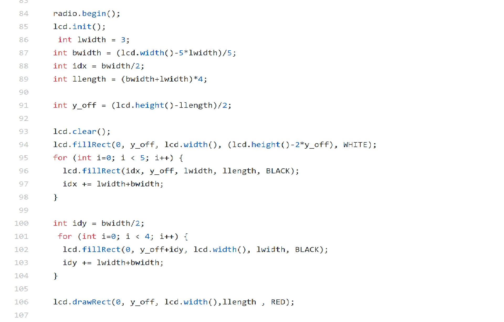

# __*Lab 4*__

### Objective
The objective of this lab was to first implement radio communication between two Arduinos and then integrate this functionality with the VGA component from Lab 3 to draw a complete maze on a VGA monitor and update the maze by transmitting information from one Arduino "radio" to the other.

### Work Distribution
As in the previous labs, we split into two sub-teams for this lab; Kelsey, Rajiv, and Christina worked on the radio component, and Aaron, David, and Adam worked on the FPGA component.

### Helpful Links
* [RF24 Class Reference](http://maniacbug.github.io/RF24/classRF24.html)

### Lab Documentation

#### Materials
* 2 Nordic nRF24L01+ transceivers
* 2 Arduino Unos
* 2 radio breakout boards
* FPGA
* 1 VGA cable
* 1 VGA connector
* 1 VGA switch
* Resistors

#### Radio Team

##### Setup
For setup, we first connected the two Nordic transceivers to each of our Arduinos in the correct SPI pins. After that we downloaded the specified RF24 Arduino library into the Arduino folder. As an extra note, we also had to move a printf.h function from a nested folder out into the main RF24 folder so that the example code, GettingStarted, could run. From here we were able to start working on our goals for lab 4.

##### Implementation
To implement the radio transmission, there were approximately two segments of code we had to configure: the transmit code and the receive code. Provided in the initial code downloaded from the sample library was a skeleton for the transmission and receive protocols. In the initial code, all it did was send a garbage value and verify that it was received by displaying “ok” on the serial monitor. It was very basic, however provided a rigid structure for adding more complex functionality.

[Here's a demonstration of the communication between the two Arduinos!](https://www.youtube.com/watch?v=0cg3QgOLpR0)

Our first step was to transmit our own unique values. This amounted to sending a custom maze, similar in format to the one sent by Team Alpha in their demo. We did this by initializing a char maze as a global variable, ensuring that the maze data was less than the default data packet size, 32-bytes. Our 4x5 maze of chars, as you can see, is significantly less than this, so there was no errors in this regard.

In the transmit code, we merely had to change a single line of code, so that now it would transmit the maze structure via the radio.write() function. On the receive side as well, we merely had to save this data into a separate local variable got_maze which we then displayed to the serial monitor via a for-loop that iterated through the individual positions in the maze and displayed the data.

Once we ensured that we could configure the transmit and receive code segments to run unique values, we worked on sending varying data packets that were encoded with specific information about certain x and y positions in the maze and state values for those positions. Similar to the example, we encoded all this information into a single byte. We used 2 bits for the x position, 3 bits for the y position, and 2 bits for the state value. In our demo, we only considered one value for the state position: visited.

The format for our data is as follows:

x position | y position | state

This came out to seven bits, which we then padded with zeros to the default data packet size of 32 bytes, and sent it across the radio using radio.write(). To parse the data into its constituent parts, we used the following three lines of code.
/*KELSEYadd the following from our code:
unsigned char p = got_data & 0b11;
        unsigned char x = got_data >> 5 & 0b11;
        unsigned char y = got_data >> 2 & 0b111;
**
This allowed us to then update our maze with specific values for x and y as well as the state value. We displayed the maze in a similar manner as before and were able to update values for position on the fly during the demo.

The rest of the receive code is shown below:

*KELSEY//rest of the receive code***

#### FPGA Team

##### Setup

##### Implementation
To draw the maze we took advantage of the Adafruit GTX library. We created a white rectangle first to represented the entire poster board and then ontop of that we placed a 4 X 5 grid of lines to represent the black tape. We then placed a red rectangle ontop to denote the edge of the board.

See [here](https://www.youtube.com/watch?v=G8H8aAYuhPc) for a video demonstration of our extended display!

In [this](https://www.youtube.com/watch?v=aIYxe3nmHjY) video, you can see a demonstration of how we transmitted randomly generated coordinates from the transmitter radio to the receiver radio and then used this data to update our maze grid.
