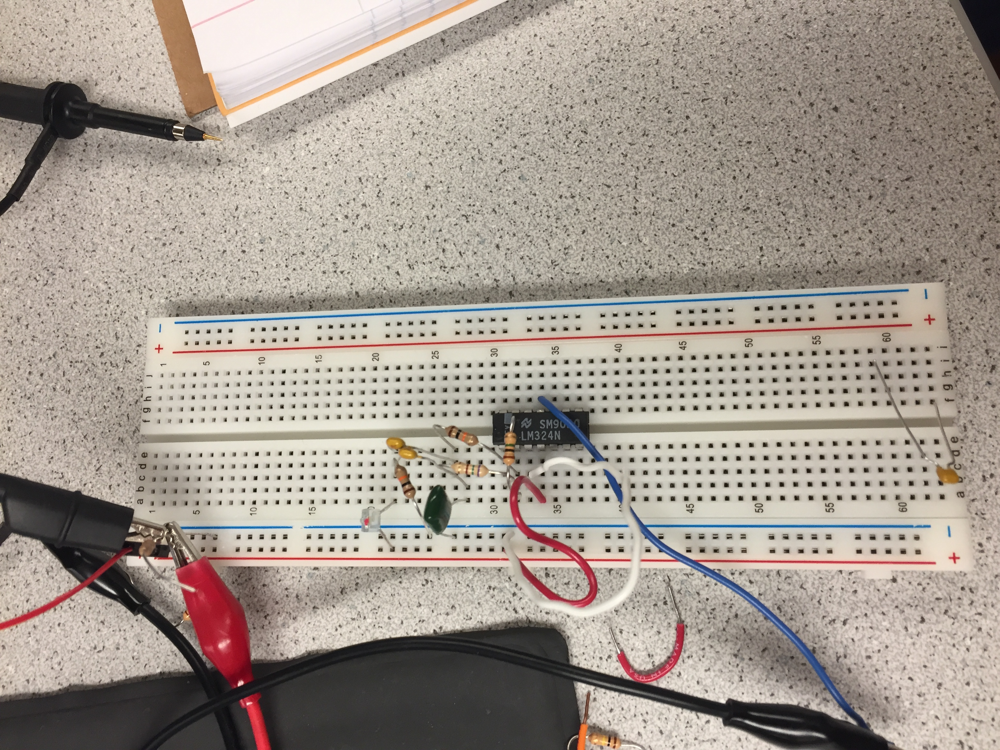

# __*Milestone 2*__

### Objective
The objective of this milestone was to add treasure detection for varying frequencies and wall detection to our robot. We implemented treasure detection for 12 and 17 kHz frequencies in addition to the 7 kHz detection that was implemented in [Lab 2](Lab2Page.md). For the wall detection, we implemented a total of three short-range sensors (left, right, and front).

### Work Distribution
The entire team worked together on this milestone. Aaron, David, and Adam worked primarily on the treasure detection, while Christina, Kelsey, and Rajiv worked primarily on the wall detection.

### Helpful Links
* [Datasheet for the short-range infrared sensor](http://www.sharp-world.com/products/device/lineup/data/pdf/datasheet/gp2y0a41sk_e.pdf)
* [Datasheet for the long-range infrared sensor](https://www.sparkfun.com/datasheets/Sensors/Infrared/gp2y0a02yk_e.pdf)

### Lab Documentation

#### Materials
* Wall sensors
* Wood block
* Resistors
* Capacitors
* Op amp
* 2 9-volt batteries
* IR Sensor
* treasures

#### Varying Treasure Frequencies
We began by using our circuit and code from lab 2 for detecting a 7kHz treasure:



| Component | Value |
| ------------- |:-------------:|
| OA1 | LM324N |
| OA1 | LM324N  |
| R1 | 10K Ohms |
| R2 | 10K Ohms |
| R3 | 1M Ohms |
| R4 | 10K Ohms |
| R5 | 100K Ohms |
| R6 | 1K Ohms |
| C1 | 4.7 nF |
| C2 | 110 pF |

The transfer function of the amplifier looks as follows. The passband is roughly 2KHz - 20KHz.


The output of the amplifier was then connected to analog input A0 of the Arduino. We basically reused the code from the microphone FFT detection and calculated the FFT bin location for 7, 12, and 17KHz. However, we quickly realized that using a simple threshold detector on each exptected bin, resulted in too many false positive detections. Our solution was to rectify the output of the amplifier above with a signal diode and feed it into a 0.68uF capacitor with a 51K resistor going to ground. The capactior's positive lead (the one not connected to ground) was connected to A1 on the arduino. 

Thus, an IR signal in the passband of the amplifier will cause the rectifier capacitor to charge when the amplitude of the amplifier's output is above the Vth of the signal diode. The resistor capacitor combo acts as a low pass filter in regards to the duration of the signal. In order for the rectifier capacitor to charge, the output of the amplifier must continuously output an AC signal for a long enough duration. This technique blocks spurious background emissions that fall in passband of the amplifier that would cause a false positive if we only relied on the threshold FFT technique. Since, the treasure outputs a continuous AC signal, this will cause the rectifier capacitor to charge to a voltage far higher than what is possible from simple spurious background emission in our amplifiers passband. A treasure is then simply detected by looking for a voltage on the rectifier capacitor above a set threshold. 

After a tresure is detected using this technique, only then do we utilize the FFT bin threshold technique described above to determine what frequency this particular treasure is. Here is a code snippet, note that `res` is the voltage on the rectifer capacitor and `getFreq()` utilizes the FFT to try to classify whether it is a 7, 12, or 17KHz treasure. 


```c++
if (res >= DETECT_THRESH) {
    Serial.print("Detection! freq: ");
     uint8_t freq = getFreq();

    if (freq == 17) {
      Serial.println("17KHz");
    } else if (freq == 12) {
       Serial.println("12KHz");
    } else {
      Serial.println("7KHz");
    }
  } else {
    Serial.println("No detection!");
```


See the video of our robot detecting the three distinct treasure frequencies [here](https://youtu.be/YPw5q0r0l5E)!

#### Wall Detection
We began by testing both the short-range and the long-range wall sensors in order to determine which would be better for our robot in terms of how sensitive we would want to be in our wall detection. After determining that the short-range wall sensors would be better in the context of our maze (the long-range sensors reach their "peak" detection further away from the wall, and the detected values closer than that "peak" point are inaccurate), we tested our sensors again, this time to gauge a reasonable threshold at which to have our robot "register" the presence of a wall. For the purposes of this milestone, we used an external LED to indicate whether or not a wall is present. As shown in the code snippet below, when the analog input value from the wall sensor is above our measured threshold, the LED is turned on; when the input value is below the threshold, the LED is turned off.

```c++
int front_dist = analogRead(FRONT_WALL);

if(front_dist > THRESHOLD) {
  digitalWrite(FRONT_LED, HIGH);
} else {
  digitalWrite(FRONT_LED, LOW);
}
```

See [here](https://www.youtube.com/watch?v=70y1C5KFJqg) for a video demonstration of our robot's wall detection functionality!
